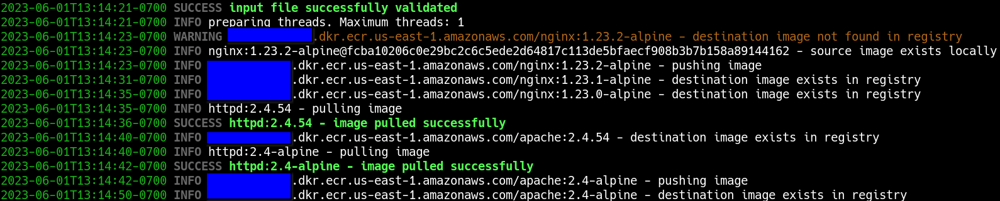

**container-image-replicator** (_CIR_ for short)

- [About](#about)
- [Usage](#usage)
  - [CLI](#cli)
  - [Config File](#config-file)
    - [Replication](#replication)
    - [Building](#building)
- [Configuration](#configuration)
  - [Requirements:](#requirements)
  - [Installation](#installation)
  - [Putting it in your `$PATH`](#putting-it-in-your-path)
    - [Linux](#linux)
      - [Binary](#binary)
      - [User-Level Python Requirements](#user-level-python-requirements)
    - [Virtualenv with pip](#virtualenv-with-pip)
  - [MacOS](#macos)
  - [Run](#run)
    - [Example](#example)
    - [kubectl to list all of your container images](#kubectl-to-list-all-of-your-container-images)
- [References](#references)
- [Dev](#dev)
  - [`mypy` for type hinting](#mypy-for-type-hinting)
  - [Code Validation](#code-validation)
  - [Miscellaneous Info](#miscellaneous-info)
  - [The Future](#the-future)

---

[](https://GitHub.com/Naereen/StrapDown.js/graphs/commit-activity)


[](https://svgshare.com/i/Zhy.svg)
[](https://svgshare.com/i/ZhY.svg)
[](https://www.python.org/)
[](https://github.com/DaemonDude23/container-image-replicator/actions/workflows/main.yaml)

# About

It's always a good idea to maintain your own copies of container images you depend on.
Whether there's an outage with an upstream registry provider, [rate limiting](https://docs.docker.com/docker-hub/download-rate-limit/), speed, saving on bandwidth costs with AWS ECR VPC endpoints, it's just a good idea to keep your containers close and within your control.

**container-image-replicator** takes a YAML file that looks something like this:

```yaml
---
images:
  - destination:
      repository: 000000000000.dkr.ecr.us-east-1.amazonaws.com/nginx
      # tag: 1.23.2-alpine  # optional
    source:
      repository: docker.io/nginx
      tag: 1.23.2-alpine
      # sha256: fcba10206c0e29bc2c6c5ede2d64817c113de5bfaecf908b3b7b158a89144162  # optional
  - destination:
      repository: 000000000000.dkr.ecr.us-east-1.amazonaws.com/apache
      tag: 2.4.54  # optional
    source:
      forcePull: true
      forcePush: false
      repository: docker.io/httpd
      tag: 2.4.54-alpine
```

And pulls/downloads the image from the source repository, re-tags it, and pushes/uploads it into the destination registry.
You can re-tag an image however you like, or keep it the same as it was.

# Usage

**This script does not handle authentication!**

If you're logging into [AWS ECR](https://docs.aws.amazon.com/AmazonECR/latest/userguide/getting-started-cli.html), for example, first login with something like:
```bash
aws ecr get-login-password --region us-east-1 | docker login --username AWS --password-stdin 000000000000.dkr.ecr.us-east-1.amazonaws.com
```
See [References](#references).

## CLI

```
usage: container-image-replicator [-h] [--version] [--max-workers MAX_WORKERS] [--log-level LOG_LEVEL] [--force-pull-push] [--no-color] input_file

description: make copies of container images from one registry to another

options:
  -h, --help            show this help message and exit

optional:
  --version, -v         show program's version number and exit
  --max-workers MAX_WORKERS
                        maximum number of worker threads to execute at any one time. One thread per container image (default: 2)
  --log-level LOG_LEVEL
                        set logging level (INFO, ERROR, DEBUG) (default: INFO)
  --force-pull-push     don't check destination or local image cache and pull and push. Useful for mutable tags. Be careful, as this
                        can hit rate limits quickly! (default: False)
  --no-color, --no-colors
                        disable color output from the logger (default: False)

required:
  input_file            path to YAML file containing registry information
```

## Config File

You can combine replication configs with building configs. First it will perform builds, then it will go through replications.
The key difference is the source key `source`, which is used for replicating, and `build`, which is used for performing `docker build`.

### Replication

This is a description of of the fields available in the config file:
```yaml
---
images:  # required
  - destination:  # required
      repository: 000000000000.dkr.ecr.us-east-1.amazonaws.com/nginx  # required - image repository of destination
      tag: 1.23.2-alpine  # optional - if this isn't populated, the source tag is used for the destination
    source:  # required
      repository: docker.io/nginx  # required
      tag: 1.23.2-alpine  # required - image tag from source repository
      sha256: fcba10206c0e29bc2c6c5ede2d64817c113de5bfaecf908b3b7b158a89144162  # optional
```

### Building

This is a description of of the fields available in the config file:
```yaml
---
images:
  - destination:
      repository: 000000000000.dkr.ecr.us-east-1.amazonaws.com/scratch
    build:  # optional
      build_args:  # optional
        AWS_ACCOUNT_ID: 000000000000  # optional
      build_folder: ../tests/builds/  # required
      dockerfile: ../tests/builds/Dockerfile  # optional
      tags:  # required
        - v1.0.0
```

# Configuration

## Requirements:

- Python `3.6+` (or manually adjust [./src/requirements.txt](./src/requirements.txt) with more broad constraints)
- `docker` installed and running on the system where this script executed, and sufficient permissions for the user executing `container-image-replicator`

## Installation

- Check the assets for releases for single-file releases of this script with dependencies.
- For local installation/use of the raw script, I use a local virtual environment to isolate dependencies:

```bash
git clone https://github.com/DaemonDude23/container-image-replicator.git -b v0.11.0
cd container-image-replicator
```

## Putting it in your `$PATH`

Single-file executibles which contain all dependencies (similar to a Go binary) are available for Linux, Windows, and MacOS. I've only really tested the Linux one. If there's a problem with the others, open an issue.

### Linux

#### Binary

Install:
   ```bash
   wget https://github.com/DaemonDude23/container-image-repliactor/releases/download/v0.11.0/container-image-repliactor.bin
   mv container-image-replicator.bin container-image-replicator
   sudo install container-image-replicator /usr/local/bin
   ```

Now it'll be available in your `$PATH`.

#### User-Level Python Requirements

1. Create symlink:
```bash
sudo ln -s /absolute/path/to/src/container-image-replicator.py /usr/local/bin/container-image-replicator
```
2. Install dependencies:
```bash
# latest and greatest dependency versions
pip3 install -U -r /path/to/src/requirements.txt
```

### Virtualenv with pip

Assuming virtualenv is already installed...

```bash
virtualenv --python=python3.11.5 ./venv/
source ./venv/bin/activate
./venv/bin/python -m pip install --upgrade pip
pip3 install -U -r ./src/requirements.txt
```

## MacOS

Do the same as above, but use the mac-specific `requirements.txt` file:

```bash
# latest and greatest dependency versions
pip3 install -U -r /path/to/src/requirements-mac.txt
```

## Run

### Example

```bash
# this file doesn't exist in git since it contains my account IDs, but just point it to ./tests/yamls/test1.yaml after updating it
./src/container-image-replicator.py ./tests/yamls/test2.yaml
```



### kubectl to list all of your container images

```bash
kubectl get pods --all-namespaces \
  -o jsonpath="{.items[*].spec.containers[*].image}" | \
  tr -s '[[:space:]]' '\n' | sort | uniq -c
```

# References

- [AWS ECR](https://docs.aws.amazon.com/AmazonECR/latest/userguide/getting-started-cli.html)
- [GCP Registry Authentication](https://cloud.google.com/container-registry/docs/advanced-authentication)
- [Azure Container Registry Authentication](https://learn.microsoft.com/en-us/azure/container-registry/container-registry-authentication?tabs=azure-cli)

# Dev

- [docker-py](https://docker-py.readthedocs.io/en/stable/index.html)

## `mypy` for type hinting

```bash
mypy ./src/ --check-untyped-defs
```

## Code Validation

```bash
mypy --install-types
mypy --install-types --non-interactive --ignore-missing-imports ./src/
```

## Miscellaneous Info

If you need a named capture group to capture logs in a semi-structured way, this should work:

```
(?<timestamp>^\d{4}-\d{2}-\d{2}T\d{2}:\d{2}:\d{2}-\d{4})\s(?<level>\w+)\s(?<message>.+)
```

## The Future

Any help with these things would be appreciated.

- I'm considering adding support for
  - [PodMan](https://github.com/containers/podman-py) to push images. This would allow a non-`root` user to run this which is always good.
  - Scan **Kubernetes** and generate a file containing all images, allowing the user to customize it further for their specific destination repositories.
    - Equivalent of `kubectl get` for Pods with `annotations` that are watched by CIR and periodically
    - Can be run inside of Kubernetes or outside of it.
    - Would require building and maintaining container images and a Helm Chart.
